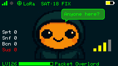

# GhostBLE



**A BLE privacy scanner for M5Stack devices**

GhostBLE discovers nearby Bluetooth Low Energy devices, analyzes their privacy posture, and flags potential security concerns. Built for security researchers, tinkerers, and educators interested in BLE privacy, device fingerprinting, and wireless reconnaissance.

A friendly mascot named **NibBLEs** guides you through the scanning process on the built-in display.

> [!WARNING]
> GhostBLE is intended for legal and authorized security testing, education, and privacy research only. Use of this software for any malicious or unauthorized activities is strictly prohibited. The developers assume no liability for misuse. Use at your own risk.

---

## Quick Start

1. Flash the firmware (see [Building & Flashing](#building--flashing))
2. Insert a **microSD card** (required on Cardputer for logging and XP)
3. Power on — NibBLEs greets you on the display
4. **Long press BtnA** (1 second) to start scanning
5. Watch devices appear on the display and in the logs

---

## Supported Hardware

| Device | Platform | Display | Keyboard | SD Card |
|--------|----------|---------|----------|---------|
| **M5Stack Cardputer** | ESP32-S3 | 240x135 LCD | Yes | Yes |
| **M5StickC Plus 2** | ESP32 | 240x135 LCD | No (2 buttons) | No |
| **M5StickS3** | ESP32-S3 | 128x128 LCD | No (2 buttons) | No |

All devices support BLE scanning, GATT connections, GPS wardriving, WiFi dashboard, and PwnBeacon. The Cardputer adds keyboard controls, SD card logging, XP persistence, and screenshot capture.

---

## Features

### BLE Scanning & Analysis

- **Passive BLE scanning** — discovers nearby devices with signal strength (RSSI) and estimated distance
- **Device info extraction** — retrieves names, service UUIDs, and manufacturer-specific data
- **GATT connections** — connects to devices and reads standard BLE services (Device Info, Battery, Heart Rate, Temperature, Generic Access, Current Time, TX Power, Immediate Alert, Link Loss)

### Privacy Heuristics

- **Rotating MAC detection** — flags devices using Resolvable Private Addresses (RPA)
- **Cleartext detection** — flags devices leaking unencrypted identifiers
- **Exposure classification** — rates devices into tiers (None, Passive, Active, Consent) with a privacy score

### Security Analysis

- Detects **writable characteristics** (potential for unauthorized writes)
- Identifies **DFU** and **UART** services (expanded attack surface)
- Checks for **encryption** on sensitive services
- Builds **device fingerprints** from advertised UUIDs and GATT profiles

### Known Device Detection

- **Flipper Zero** — detected by known service UUIDs (black, white, transparent variants)
- **CatHack / Apple Juice** — BLE spam tool detection
- **Tesla** — detected via iBeacon UUID, GATT service, and name pattern matching
- **LightBlue** — app-based BLE testing tool
- **PwnBeacon / Pwnagotchi** — detects and reads PwnGrid beacons (identity, face, pwnd counters, messages)

### PwnBeacon

GhostBLE acts as both a PwnBeacon **client** (scanner) and **server** (advertiser), compatible with [PwnBook](https://github.com/pfefferle/PwnBook) and [Palnagotchi](https://github.com/pfefferle/palnagotchi):

- Advertises as a PwnBeacon with SHA-256 fingerprint, identity JSON, face, and device name
- Detects nearby PwnBeacon peers via advertisement service data
- Reads full peer info via GATT (identity, face, name, message)
- Signal/ping characteristic for peer interaction
- Pwnd counters update dynamically during scanning

### Manufacturer Identification

Decodes manufacturer data for Apple, Google, Samsung, Epson, and more. Also parses **iBeacon** advertisements (UUID, major, minor, TX power, distance).

### GPS & Wardriving

- **Dual GPS support** — Grove UART and LoRa cap GPS (Cardputer only for LoRa)
- **WiGLE CSV export** — log devices with location for mapping and analysis

### Logging

All findings are logged to multiple channels simultaneously:

| Channel | Details |
|---------|---------|
| **Serial** | 115200 baud, structured output |
| **SD card** | Per-category log files (Cardputer only) |
| **Web dashboard** | Real-time via WiFi AP and WebSocket |

Logs are organized into categories: Scan, GATT, Privacy, Security, Beacon, Control, GPS, System, Target, and Notify. Each device gets a **session ID** for cross-log correlation.

### XP System

GhostBLE gamifies the scanning process with experience points:

| Event | XP |
|-------|-----|
| Device discovered | +0.1 |
| GATT connection success | +0.5 |
| Characteristic subscription | +1.0 |
| PwnBeacon detected | +1.0 |
| UINT/FLOAT payload decoded | +1.0 |
| Notify data received | +1.5 |
| Manufacturer data decoded | +2.0 |
| Suspicious device found | +2.0 |
| Known characteristic decoded | +2.5 |
| iBeacon parsed | +3.0 |

XP is persisted to the SD card (Cardputer) and shown on the display with level progression.

### NibBLEs

NibBLEs is the on-screen mascot with context-sensitive expressions and speech bubbles:

- **Expressions** — happy, sad, angry, glasses (detective), thug life, sleeping, hearts, and more
- **Speech bubbles** — context-aware messages for idle, scan start, wardriving, suspicious finds, and level-ups
- **Screenshot capture** — press ENTER on Cardputer to save the current display to SD

---

## Controls

### Cardputer (Keyboard)

| Key | Action |
|-----|--------|
| **Long press BtnA** (1s) | Toggle BLE scanning on/off |
| **ENTER** | Capture screenshot to SD card |
| **FN** | Toggle WiFi AP and web server |
| **TAB** | Toggle wardriving mode |
| **DEL** | Switch GPS source (Grove / LoRa) |
| **H** | Help Control |
| **M** | SCAN Mode |

### M5StickC Plus 2 / M5StickS3 (Buttons)

| Button | Action |
|--------|--------|
| **BtnA short press** | Toggle WiFi AP and web server |
| **BtnA long press** (1s) | Toggle BLE scanning on/off |
| **BtnB short press** | Toggle wardriving mode |
| **BtnB long press** (1s) | Switch GPS source |

### Web Interface

1. Enable WiFi (press **FN** on Cardputer or **BtnA** on StickC/StickS3)
2. Connect to WiFi AP **`GhostBLE`** (password: **`ghostble123!`**)
3. Open **`192.168.4.1`** in a browser
4. View real-time device discovery logs via WebSocket

---

## Building & Flashing

### PlatformIO (Recommended)

```bash
# Cardputer
pio run -e ghostble -t upload

# M5StickC Plus 2
pio run -e ghostble-stickcplus2 -t upload

# M5StickS3
pio run -e ghostble-sticks3 -t upload
```

### Arduino IDE

1. Install the **M5Stack board package** via Board Manager
2. Select the appropriate board for your device
3. Install the required libraries via Library Manager:
   - `M5Cardputer` / `M5StickCPlus2` / `M5Unified` — hardware abstraction (depends on device)
   - `NimBLE-Arduino` — BLE stack
   - `ESPAsyncWebServer`, `AsyncTCP` — web dashboard
   - `TinyGPSPlus` — GPS parsing
4. Open `GhostBLE.ino`, compile, and upload

---

## Sample Output

```
<NoName> MAC: d3:c9:9d:fa:d9:9a | Rotating: Yes | Cleartext: Yes
Trying to connect to address: d3:c9:9d:fa:d9:9a
Attribute discovery failed: d3:c9:9d:fa:d9:9a

Scan Summary:
- Spotted: 4
- Sniffed: 2
- Suspicious: 0
```

---

## Project Structure

```
GhostBLE/
├── GhostBLE.ino              # Main sketch (setup, loop, WiFi, controls)
├── platformio.ini             # PlatformIO build configuration
├── boards/                    # Custom board definitions (Cardputer, StickC+2, StickS3)
└── src/
    ├── GATTServices/          # BLE service readers (9 standard + PwnBeacon)
    ├── analyzer/              # Exposure analysis & security scoring
    ├── config/                # Hardware config, known device UUIDs
    ├── globals/               # Shared state variables
    ├── gps/                   # GPS manager (Grove + LoRa cap)
    ├── helper/                # BLE decoders, manufacturer lookup, UI, speech bubbles
    ├── images/                # Sprite assets for NibBLEs mascot
    ├── logger/                # Unified multi-target logging
    ├── models/                # Data structures (DeviceInfo)
    ├── privacyCheck/          # MAC type detection, cleartext analysis
    ├── scanner/               # Core BLE scanning and GATT operations
    ├── target/                # Known device detection (Flipper, Tesla, PwnBeacon)
    ├── wardriving/            # WiGLE CSV export
    └── xp/                    # Experience points system
```

---

## Contributing

PRs and suggestions welcome! This is a learning-focused BLE project, and your ideas are appreciated.

## License

MIT License
